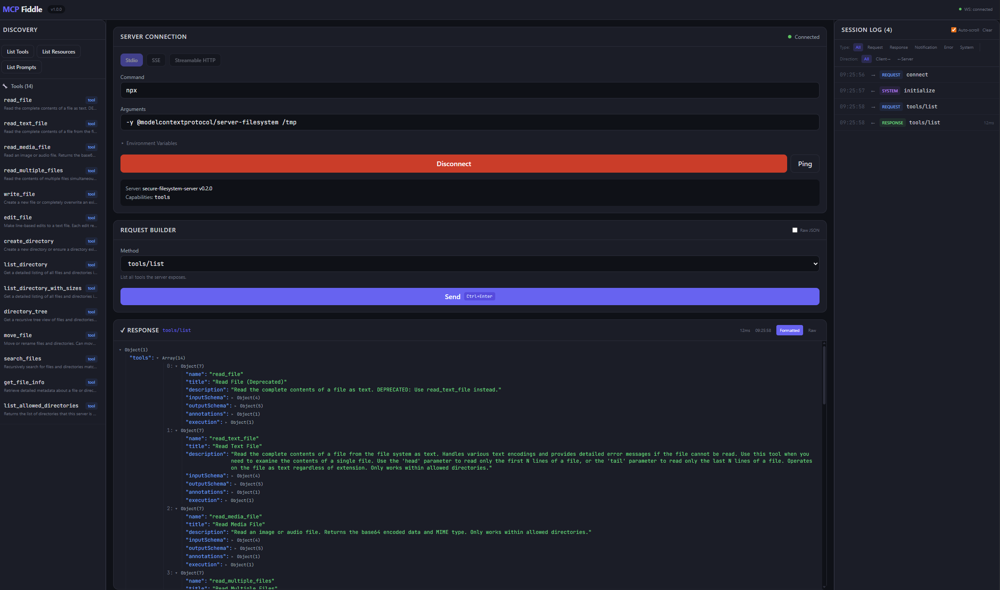

# MCP Fiddle

> **⚠️ Disclaimer:** The majority of this codebase was generated by AI. While it has been reviewed and tested, use it at your own discretion.

A browser-based inspection and debugging tool for [Model Context Protocol (MCP)](https://modelcontextprotocol.io/) servers. Think **Postman, but purpose-built for MCP** — connect to any MCP server, send requests manually, and inspect raw JSON-RPC responses in real time.



---

## Features

- **Connect to any MCP server** via **stdio** (spawned as a child process) or **SSE / Streamable HTTP** transport
- **Request Builder** — select an MCP method from a dropdown, fill in parameters with auto-generated form fields, or use the raw JSON editor for full control
- **Response Viewer** — syntax-highlighted, collapsible JSON display with raw-view toggle, error highlighting, timestamps and round-trip duration
- **Session Log** — chronological history of all requests, responses, and server-initiated notifications, filterable by method or direction
- **Discovery Sidebar** — one-click **List Tools**, **List Resources**, and **List Prompts** buttons; click any result to pre-fill the request builder
- **Environment Variables** — pass custom env vars to stdio-spawned server processes
- **Docker-ready** — single-container production deployment on one port

### Supported MCP Methods

| Method | Purpose |
|---|---|
| `initialize` | Handshake & capability exchange |
| `notifications/initialized` | Signal client readiness |
| `ping` | Health check |
| `tools/list` / `tools/call` | Discover and invoke tools |
| `resources/list` / `resources/read` | Discover and read resources |
| `resources/subscribe` | Subscribe to resource changes |
| `prompts/list` / `prompts/get` | Discover and retrieve prompts |
| `logging/setLevel` | Set server log level |
| `completion/complete` | Request argument completions |

## Tech Stack

| Layer | Technology |
|---|---|
| Frontend | React 19, TypeScript, Vite |
| Styling | Tailwind CSS |
| Backend | Node.js, Express, `ws` |
| MCP | `@modelcontextprotocol/sdk` |

---

## Getting Started

### Prerequisites

- **Node.js** 18+ and **npm**
- (Optional) **Docker** for containerised deployment

### Local Development

```bash
npm install
npm run dev
```

This starts both the Vite dev server (frontend) and the Express backend concurrently. Open **http://localhost:5173**, configure a server connection, and start exploring.

#### Example — Filesystem Server

```
Command:  npx
Args:     -y, @modelcontextprotocol/server-filesystem, /tmp
```

Click **Connect**, then use the request builder or discovery sidebar to interact with the server.

### Production Build

```bash
npm run build
npm start
```

The Express server serves both the API/WebSocket endpoint and the static frontend on **http://localhost:3000**.

### Docker

```bash
docker build -t mcp-fiddle .
docker run -p 3000:3000 mcp-fiddle
```

Open **http://localhost:3000**.

> **Note:** Stdio MCP servers are spawned *inside* the container. You may need to install additional runtimes (Python, etc.) in the Dockerfile or mount volumes for servers that access the host filesystem. For SSE/HTTP servers running on the host, use `host.docker.internal` as the hostname.

---

## Usage

1. **Configure** — Enter a stdio command + args, or an SSE/HTTP URL in the Connection Panel.
2. **Connect** — Click **Connect** to spawn/attach to the MCP server and perform the `initialize` handshake.
3. **Discover** — Use the sidebar shortcuts to list available tools, resources, and prompts.
4. **Build Requests** — Select a method, fill in params (or edit raw JSON), and click **Send**.
5. **Inspect** — View formatted or raw JSON responses, check for errors, and review the full session history.

---

## License

This project is licensed under the **Commons Clause + MIT License**. See [LICENSE](LICENSE) for full details.

**TL;DR** — Free to use, modify, and share. You may **not** sell this software or offer it as a paid service.
